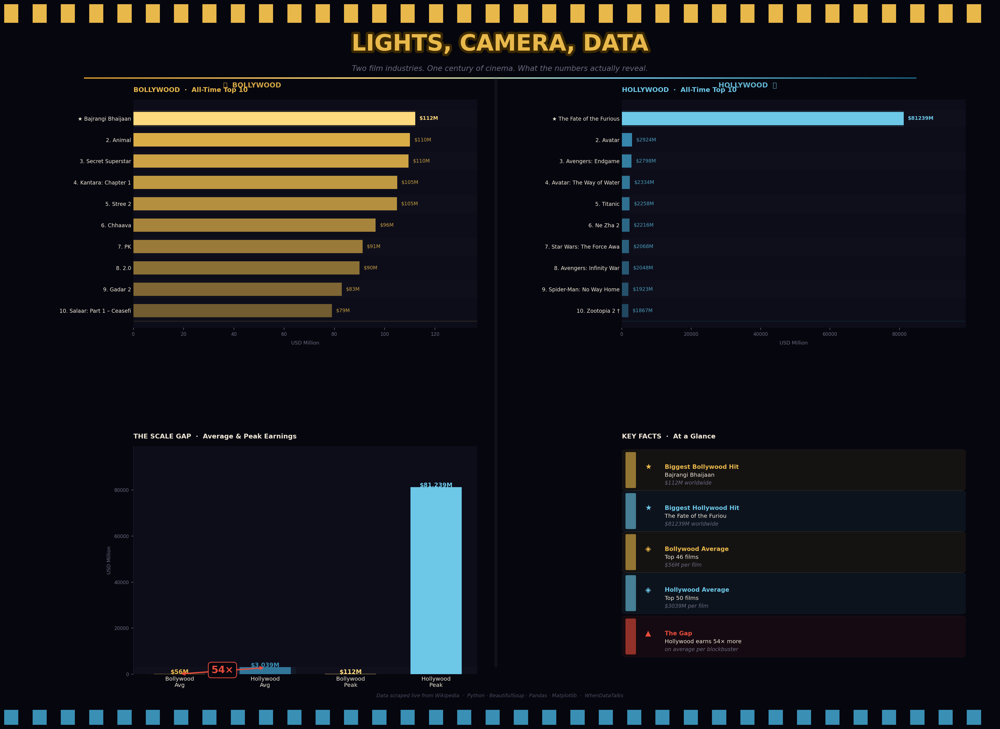

# WhenDataTalks 📊🎬

> *Two film industries. One century of cinema. What the numbers actually reveal.*

Built solo during semester break — every line understood before moving on.

---

## Day 4 — Lights, Camera, Data

### Bollywood vs Hollywood · A Box Office Deep Dive

Not a rivalry. Just two giants, side by side — where each is thriving, struggling, evolving.



### What this project does

Scrapes live box office data from Wikipedia, cleans it, and renders a cinematic dark-themed dashboard that tells the story of two industries through numbers.

### The story each chart tells

| Chart | Question it answers |
|---|---|
| Bollywood Top 10 | Who are India's all-time box office kings? |
| Hollywood Top 10 | Which films conquered the global market? |
| The Scale Gap | How far apart are the two industries, really? |
| Key Facts | The numbers that make you stop and think |

### Tech stack

`requests` · `BeautifulSoup` · `pandas` · `matplotlib` · `seaborn`

### How to run

```bash
# Step 1 — Install dependencies
pip install requests beautifulsoup4 pandas matplotlib seaborn

# Step 2 — Scrape live data
python scraper.py

# Step 3 — Clean the data
python clean.py

# Step 4 — Generate dashboard
python dashboard.py
```

### What I learned
- How to scrape real HTML tables with BeautifulSoup
- How messy real-world data is (and how to fix it)
- How to build multi-panel dashboards with matplotlib
- That Dangal still holds the Bollywood record — and it's not close

---

## Coming soon

- **Day 5** — API data puller · live weather, news, GitHub stats in terminal
- **Day 6** — Mini ML model · predict placement outcomes from real data

---

*No shortcuts. No copying without understanding. Just me figuring it out.*
